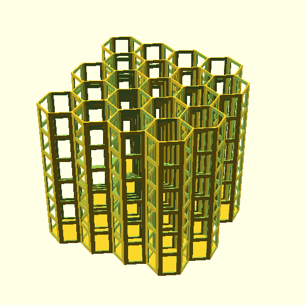
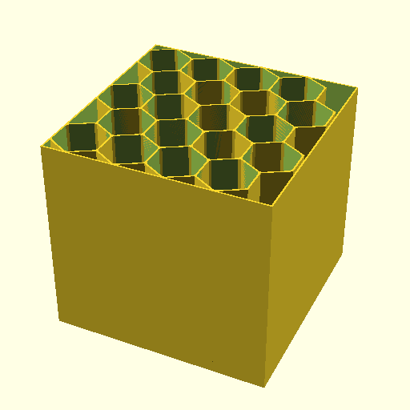
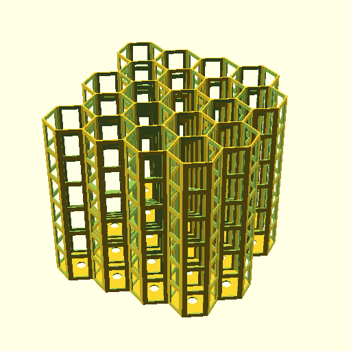

# OpenSCAD Fully parametric drawer cable storage management hive with punch cuts (Plus business card holder)(openscad-hex-cable-hive-fully-parametric)


OpenSCAD Fully parametric drawer cable storage management hex hive with punch cuts

This is an OpenSCAD sketch to generate fully customizable honeycomb wire storage system.

If you got a Prusa MK3S+ you may want to use the `*_6x5.stl` 3d prints as those are designed to fit within a prusa buildplate.

Contributions is welcomed via Pull Requests

* Originally by iX (November 02, 2016) [iX Other Designs on thingiverse](https://www.thingiverse.com/ix__/designs)
* Extended by mofosyne for punchcut support for reduce material requirement and print time (February 20, 2022)
    - Inspired by lokabayashi remix of iX's design [lokabayashi other designs](https://www.thingiverse.com/lokabayashi/designs)
    - Also added support for screw mounting as an option

## Remix Of:
  - Drawer Cable Storage Hive - Punched by lokabayashi May 07, 2020 : https://www.thingiverse.com/thing:4342689
  - Fully parametric drawer cable storage management hive by iX__ November 02, 2016 : https://www.thingiverse.com/thing:1862897
  - Cable Management Hive Remix by murlr August 24, 2016 : https://www.thingiverse.com/thing:1734587
  - Cable management Hive by Filar3D August 09, 2015 : https://www.thingiverse.com/thing:961176

---------------------------------------------------------------------------------

## Settings

In OpenSCAD you can set :
* The number of slots in Y and X direction
* The diameter of the honeycombs
* The height of the honeycombs
* The thickness of the walls

This current script which is good enough for most USB cables uses these set of parameters, assuming the usage of a standard 0.4mm nozzle.

```
cable_slot_height = 120; // depth of the slots
cable_slot_diameter = 42; // diameter of the slots
nozzle = 0.4;
nb_of_outer_shell = 3;
```

If mounting holes is enabled, by default these are the values chosen. Which was picked due to it use in some V-slot T-slot screws (10mm).

```
drillholeDiameter=8;
countersunkDiameter=15;
countersunkHeight=2;
```

## Options Available

* `I_want_a_surrounding_wall` : (default: false) set this bit to 1 if you want a square wall surrounding your cable hive. It is better to set option "I_wish_to_combine_it_later" to 0 to have nice surrounding wall
* `I_wish_to_combine_it_later` : (default: false) will add a slot on all odd Y lines so that you will be able to concatenate this part with an other on
* `I_want_side_wall_punch` : (default: true) set this bit to 1 to reduce material requirement
* `I_want_mounting_screw_holes` : (default: false)`set this bit to 1 to add mounting hole
* `I_want_lengthwise_cuts` : (default: false) set this bit to 1 to add extra internal cuts (e.g. business cards)
* `I_want_stepped_slope_cuts` : (default: false) set this bit to 1 to use stepping cuts
* `I_want_smooth_slope_cuts` : (default: false) set this bit to 1 to use sloping cuts (WARN: May have overhangs if combined with side wall punch)

## 4x5 Cable Output Spec

* External honeycomb diameter is : 42
* Internal honeycomb diameter is : 39.1594
* Requested wall width is : 1.23
* The real wall width in X is : 1.23
* The real wall width in Y is : 1.42028
* External honeycomb X size is : 36.3731
* External honeycomb Y size is : 42
* Internal honeycomb X size is : 33.9131
* Internal honeycomb Y size is : 39.1594
* Pitch in X is : 35.1431
* Pitch bis in X is : 35.1431
* Pitch in Y is : 30.4348
* Pitch bis in Y is : 30.4348
* This is wonderful cable hive you made there :)"
* Its dimensions are X = 161.834 and Y = 163.289


## 6x5 Business Cards Hive Spec

Similar to 4x5 Cable Output Spec, but specifically:
* 6x5 slots instead so that two cards can be placed per row
* slot height is 60mm instead of 120mm

--------------------------------------------------------------------------------

## Preview:

### Punch Cut


### Solid Wall


### Boxed Wall


### Punch Cut With Screwmount


### Solid Wall With Screwmount


### Business Card Holder Hive


### Business Card Holder Hive (slope cut)


--------------------------------------------------------------------------------

## License:

Fully parametric drawer cable storage management hive by `iX__` is licensed under the Creative Commons - Attributionlicense.