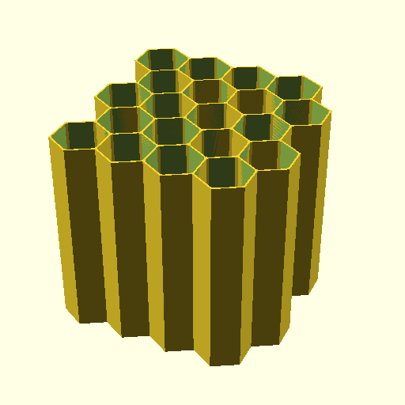

# OpenSCAD Fully parametric drawer cable storage management hive with punch cuts (openscad-hex-cable-hive-fully-parametric)





OpenSCAD Fully parametric drawer cable storage management hex hive with punch cuts

This is an OpenSCAD sketch to generate fully customizable honeycomb wire storage system.

Contributions is welcomed via Pull Requests

* Originally by iX (November 02, 2016)  [iX Other Designs on thingiverse](https://www.thingiverse.com/ix__/designs)
* Extended by mofosyne for punchcut support for reduce material requirement and print time (February 20, 2022)

## Settings

In OpenSCAD you can set :
* The number of slots in Y and X direction
* The diameter of the honeycombs
* The height of the honeycombs
* The thickness of the walls

This current script which is good enough for most USB cables uses these set of parameters, assuming the usage of a standard 0.4mm nozzle.

```
cable_slot_heigth = 120; // depth of the slots
cable_slot_diameter = 42; // diameter of the slots
nozzle = 0.4;
nb_of_outer_shell = 3;
```

## Options Available

* `I_want_a_surrounding_wall` : (default: false) set this bit to 1 if you want a square wall surrounding your cable hive. It is better to set option "I_wish_to_combine_it_later" to 0 to have nice surrounding wall
* `I_wish_to_combine_it_later` : (default: false) will add a slot on all odd Y lines so that you will be able to concatenate this part with an other on
* `I_want_side_wall_punch` : (default: true) set this bit to 1 to reduce material requirement

## 4x5 Cable Output Spec

* External honeycomb diameter is : 42
* Internal honeycomb diameter is : 39.1594
* Requested wall width is : 1.23
* The real wall width in X is : 1.23
* The real wall width in Y is : 1.42028
* External honeycomb X size is  : 36.3731
* External honeycomb Y size is : 42
* Internal honeycomb X size is  : 33.9131
* Internal honeycomb Y size is : 39.1594
* Pitch in X is : 35.1431
* Pitch bis in X is : 35.1431
* Pitch in Y is : 30.4348
* Pitch bis in Y is : 30.4348
* Its dimensions are X = 143.955 and Y = 163.289
* You have a total number of 20 slots to host your silly cables :)

## Remix Of:
  - Fully parametric drawer cable storage management hive by iX__ November 02, 2016 : https://www.thingiverse.com/thing:1862897
  - Cable Management Hive Remix by murlr August 24, 2016 : https://www.thingiverse.com/thing:1734587
  - Cable management Hive by Filar3D August 09, 2015 : https://www.thingiverse.com/thing:961176

## Licence:

Fully parametric drawer cable storage management hive by `iX__` is licensed under theCreative Commons - Attributionlicense.